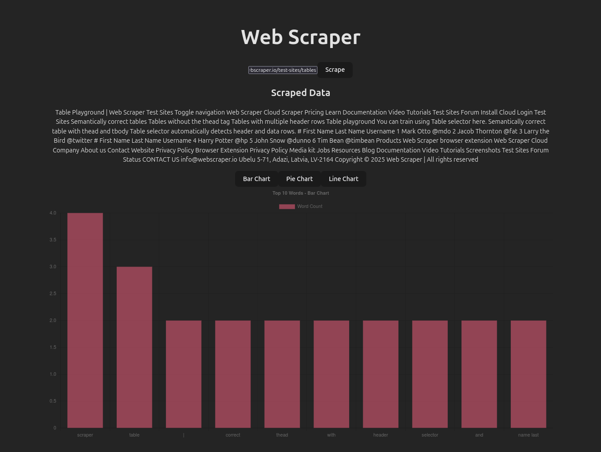
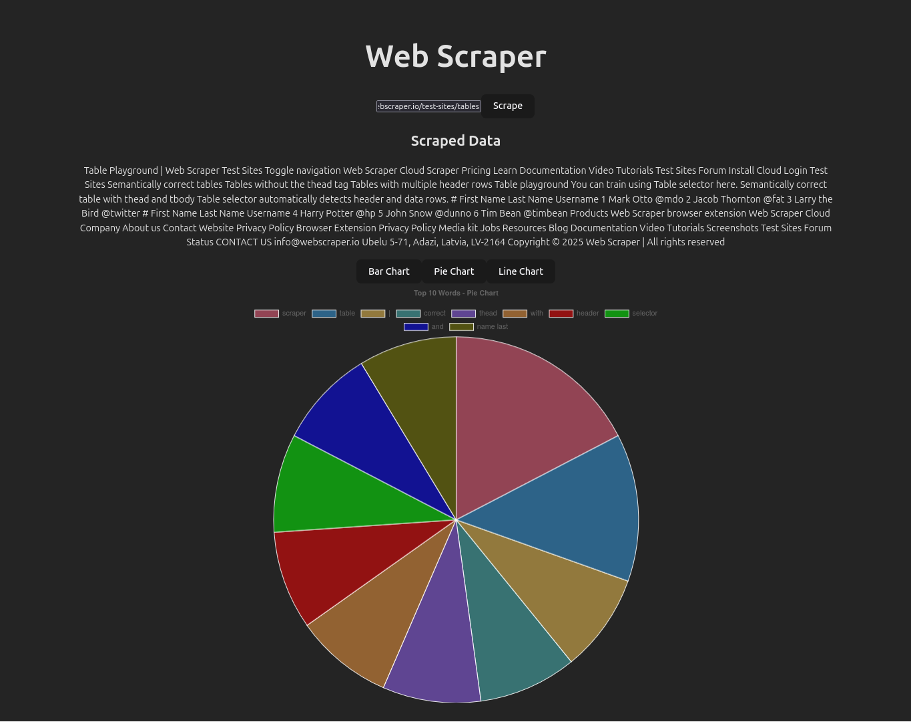
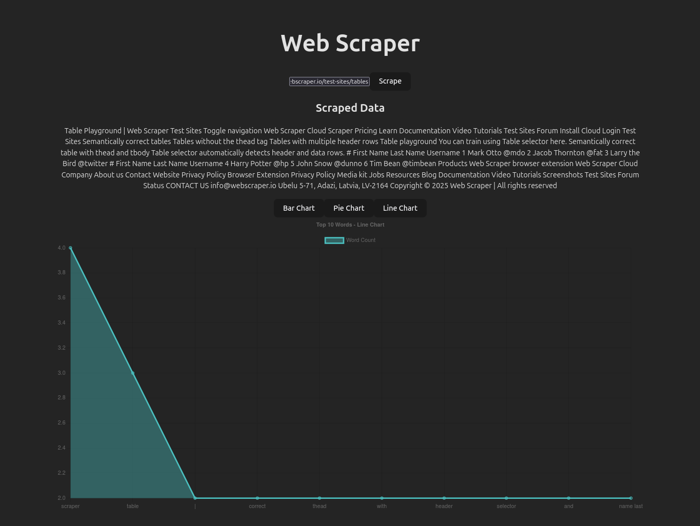

#   Custom Data Pipeline for Web Scraping & Visualization

##  Overview

This project implements a custom data pipeline for web scraping and visualization. Users can input a website URL, and the system scrapes relevant data, stores it, and displays visual insights.

##  Features

* **Web Scraping:** Extracts data from user-provided URLs using Beautiful Soup.
* **Data Storage:** Stores scraped data in a database (SQLite for development).
* **Data Visualization:**
    * Bar chart for word frequency.
    * Pie chart for word proportions.
    * Line chart for word count.
* **Updates:** Updates data using Celery.
* **API:** Django REST Framework for API endpoints.

##  Technologies Used

* **Backend:** Django, Django REST Framework, Celery, Redis
* **Frontend:** React, Axios, react-chartjs-2
* **Database:** SQLite (development)
* **Web Scraping:** Beautiful Soup

##  Screenshots





##  Setup Instructions

1.  **Clone the repository:**

    ```bash
    git clone <repository_url>
    cd backend-datapipe
    ```

2.  **Set up the backend:**

    * Create a virtual environment (if you haven't already):

        ```bash
        python3 -m venv .venv
        ```

    * Activate the virtual environment:

        ```bash
        source .venv/bin/activate  # Linux
        ```

    * Install dependencies:

        ```bash
        pip install -r requirements.txt
        ```

    * Apply database migrations:

        ```bash
        python3 manage.py makemigrations scraper
        python3 manage.py migrate
        ```

    * Run the Django development server:

        ```bash
        python3 manage.py runserver
        ```

    * Start Celery worker and beat (ensure Redis is installed and running):

        ```bash
        celery -A datapipe worker -l info -B
        ```

3.  **Set up the frontend:**

    * Navigate to the frontend directory:

        ```bash
        cd frontend
        ```

    * Install dependencies (if you haven't already):

        ```bash
        npm install
        ```

    * Run the React development server:

        ```bash
        npm run dev 
        ```

##  API Endpoints

* Request `POST /api/scrapeddata/scrape/`: Scrape data from a URL.

     ```json
        {
            "url": "https://www.example.com"
        } 
* Request `GET /api/scrapeddata/`: Retrieve scraped data.

    ```json
        {
                "id": 1,
                "url": "https://www.example.com",
                "data": "Scraped data....."
                "timestamp": "date-time",
                "user": 1
        }
##  Notes

* Authentication is temporarily disabled for demonstration purposes. In a production environment, proper user authentication would be implemented using JWT (JSON Web Tokens) to secure API endpoints and user data.